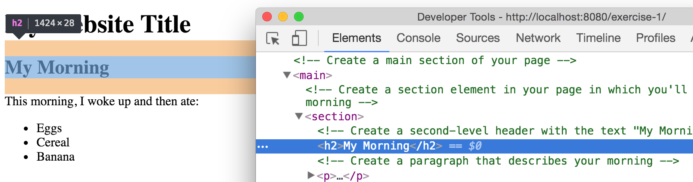

# Set-up Your Machine

In this course, we'll be using a variety of different software programs to write, manage, and execute the code that we write. Unfortunately, one of the most frustrating and confusing barriers to start working with code is simply getting your machine properly set-up. This repository aims to provide sufficient information for setting up your machine, and troubleshooting the process. Do your best to follow instructions and search for help online, but don't waste too much time before contacting your TA. We'll also set aside time in the first lab session to help with machine set-up.

Note, classroom machines for this course should have all appropriate software already installed and ready to use. Here are a few links to help with your downloads:

tl;dr - make sure you have the following installed:

- **Web browser**: [Google Chrome](https://www.google.com/chrome/browser/desktop)
- **Text Editor**: Your choice, I suggest [Atom](https://atom.io/), [SublimeText3](http://www.sublimetext.com/3), or [Visual Studio Code](https://code.visualstudio.com/)
- **Version Control**: Install [Git](https://git-scm.com/downloads) for version control (we expect you to be able to use the command-line tools)
- **Local Server**: Be able to run a local server, which you can do using your preferred version of [python](https://www.python.org/downloads/), [Node](https://nodejs.org/en/download/), or a UI tool like [WampServer](http://www.howtogeek.com/177129/beginner-geek-how-to-host-your-own-website-on-windows-wamp/)


The following sections have additional information about the purpose of each component, how to install it, and alternative configurations.

## Web Browser
While we will aim to build visualizations that look good and function well across web browsers, the suggested web browser for _development_ is [Google Chrome](https://www.google.com/chrome/browser/desktop). Amongst other tools, the inspector (right click, Inspect _or_ `cmd` + `alt` + `i`) provides a great way to view page elements and interact with a JavaScript console:



## Text Editor
In order to write code, you need somewhere to write it (obviously). There are a variety of available programs that provide an interface for editing code. A major advantage of these programs is that they provide automatic formatting for easier interpretation of the code, along with cool features like auto-completion and integration with version control.

You really only need to download one of the following programs, but feel free to download multiple text-editors to compare and contrast how you like them.

### Atom
Atom is a text editor built by the folks at GitHub, and has been gaining in popularity. As an open source project, people are continually building (and making available) interesting/useful extensions. It's built-in spell-check is a great feature, especially for documents that require lots of written text (also has an easy Previewer for Markdown). See more and download [here](https://atom.io/).

### SublimeText
SublimeText is a very popular text editor with excellent defaults and a variety of available extensions. One drawback is that, to use it without paying, you are using an unlimited free trial. Every ~10 times you save a file, it will ask you if you want to purchase the full version, which is a bit distracting. [SublimeText2](http://www.sublimetext.com/2) is the current stable version of the software, though feel free to install [SublimeText3](http://www.sublimetext.com/3) if you don't mind using software that's in beta.

### Visual Studio Code
Microsoft's free and open source text editor Visual Studio Code has a suite of built-in functionalities, and some really nice keyboard shortcuts for web-development. Download [here](https://code.visualstudio.com/).


## Version Control
Git is a version control system that provides a set of commands that allow you to manage changes to a project (much more on this in [module-3](https://github.com/info474-s17/m4-version-control)). For now, you'll need to [download](https://git-scm.com/downloads) and install the software. Note, if you are using a Windows machine, this will install a program called **Git Bash**, which provides a text-based interface for executing commands on your computer. For alternative/additional Windows command-line tools, see below.

## Command-line Tools (Windows)
The command-line provides you a text-based interface for providing instructions to your computer. In this course, we'll largely use the command-line for navigating our computer's file structure, and executing commands that allow us to keep track of changes to the code we write (i.e., version control). If you're using a Mac, you are able to access your command-line by default, and don't need to install any additional software. If you're using a Windows machine, you'll need to install one of the following programs in order to interact directly with the command-line.

### Git Bash
Because we'll primarily use the command line for implementing version control (i.e., keeping track of changes to our code), we can use a command-line tool that ships with the version control software, Git. When you download the [Git](https://git-scm.com/downloads) software on Windows, the Git Bash user-interface will be installed. You can then navigate to Git Bash from your Desktop / Start Menu, and you will be able to use the appropriate syntax to keep track of code changes.

### Windows Bash
With the release of Windows 10, Windows began providing command line (bash) support. If you already have Windows 10, here are a few [instructions](http://www.howtogeek.com/249966/how-to-install-and-use-the-linux-bash-shell-on-windows-10/) for installing bash capabilities. This requires that you [switch to 64 bit windows](http://www.howtogeek.com/228042/how-to-switch-from-32-bit-windows-10-to-64-bit-windows-10/), and follow the instructions above. While this will provide you with direct bash capabilities, you may run into challenges along the way (I have not tested these instructions). Note, you will still **need to install Git** in addition to Windows Bash.

### Powershell (Windows Management Framework)
If you want to explore more robust command-line alternatives for Windows, the Windows Management Framework (including a program called Powershell) seems to be a preferred standard. Powershell will provide a simple text-based interface for inputing commands. Note, you will still **need to install Git** in addition to Powershell.


## Local Servers
In order to properly run and test a web application, you'll need a server to pass your files to your web-browser. Luckily, there are a variety of command-line tools (as well as GUIs) for running a server. Again, you'll only need to use one of the following approaches.

### Python
The simplest approach, particularly if you are using a mac, is to use Python to run a web server. It is likely already installed on your machine, or can be downloaded [here](https://www.python.org/downloads/). Using your terminal, you navigate to the directory in which you've saved your website files, and then run a server with the following line of code:

```bash
python -m SimpleHTTPServer 8080
```

You can then use any web-browser to open up the URL `localhost:8080` to view your web content.

### Node: HTTP Sever
The Node.js program allows you to execute JavaScript code on your machine, which is awesome! You'll need to download some intermediary software to get this option working, but it will be well worth your time.

1. First, you'll need to [download node](https://nodejs.org/en/download/). If you're not sure if you're installed it yet, you can type `node --version` into your terminal.
2. Then, you'll need to install the Node Package Manager [NPM](https://www.npmjs.com/), which allows you to easily install node programs.
3. Finally, use the npm command-line utility to install `http-server`:  `npm install http-server -g`    

Once you've installed the `http-server` utility, you can easily start a local server on your command-line:

```bash
# Start server at localhost:8080
http-server "localhost:8080"
```

### WampServer
If you're using a Windows machine (and have trouble installing Python or `http-server`), you can download a GUI such as WampServer (there are many alternatives as well). The program will require that you save your files in specific locations, and can become a bit cumbersome. For more details on setting up WampServer, see [this tutorial](http://www.howtogeek.com/177129/beginner-geek-how-to-host-your-own-website-on-windows-wamp/).


If you run into any installation/configuration challenges, please let others know on the [slack channel](https://info474-s17.slack.com) so that others can anticipate the same issues.
